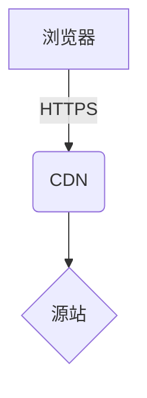

## 一、什么是 draw.io？

- 诞生于 2000 年，2019 年更名为 diagrams.net，但域名与口碑仍叫 draw.io  
- 完全 **MIT 开源**，代码在 [GitHub](https://github.com/jgraph/drawio) 超 25 k Star  
- 支持 **Web / Windows / macOS / Linux / Chrome PWA / VS Code 插件 / Docker 私有化**  
- 文件格式默认 `.drawio`（XML 压缩），也可导出 SVG/PDF/PNG/HTML/Mermaid  
- **零注册、零广告、零付费陷阱**——官网在线版用完即走，连 Cookie 都不怎么写

官网秒开：  
👉 [https://app.diagrams.net](https://app.diagrams.net)（国内镜像 [https://drawio.zhhaino.com](https://drawio.zhhaino.com)）

---

## 二、一句话看懂亮点

| 场景 | draw.io 怎么做 | 同类泪点 |
|---|---|---|
| 🚀 启动速度 | 浏览器 1 s 打开，离线 PWA 无网也能画 | Visio 安装 30 min+ |
| 🧩 嵌入文档 | 复制为 SVG 直接粘进 Typora / Notion / Obsidian，支持 Dark Mode 自适应 | PlantUML 需要渲染服务器 |
| 🌐 多人协作 | 基于 OneDrive / Google Drive 实时协同，光标可显示昵称 | ProcessOn 限制 9 人 |
| 🎨 模板市场 | 官方 400+ 模板 + 社区 2 000+ 模板，AWS/Azure/K8s 图标一键拖 | PPT 自己画到凌晨 |
| 🔒 数据安全 | 可选 **完全离线** 保存到本地硬盘，流量 0 上传 | Lucidchart 默认云端 |
| 🧑‍💻 开发者友好 | 有 VS Code 插件，`.drawio` 文件 Git diff 可读，CI 可自动导出 PNG | 二进制文件无法 review |

---

## 三、30 秒极速上手

1. 打开 [app.diagrams.net](https://app.diagrams.net) → 选择 **保存位置 = Device**（完全离线）  
2. 左侧 **General** 拖一个 **Rectangle** → 双击写“开始”  
3. 右侧 **Style** 把 Fill 设为 `#FFCB3B` → 圆角 12 → 阴影 6  
4. 选中形状 → `Ctrl+C` → `Ctrl+Shift+V` 垂直复制 → 写“结束”  
5. 上方 **箭头** 连线 → 右键 **Waypoints** → 选 **Curved** 秒变柔美曲线  
6. 顶部 **File → Export → SVG** → 勾选 **Include a copy of my diagram**（二次编辑）→ 完成  

**恭喜你，已经生成一个可 Git 追踪、可 Dark Mode、可二次编辑的架构图！**

---

## 四、高阶玩法

### 1. 与 Markdown 双向奔赴

- 在 Obsidian 安装 **Drawio Integration** 插件  
- 新建 `flow.drawio` → 编辑完自动回写同名 `.svg`  
- 文档里 `![[flow.svg]]` 即可预览，**GitHub 渲染同样无异常**  
- 夜间 Obsidian 切 Dark → SVG 自动反色，无需两套图

### 2. 让 CI 帮你“出图”

官方提供 **headless Docker**：

```bash
docker run -it --rm -v $(pwd):/data jgraph/drawio-export \
  -f png -w 1600 -h 900 /data/arch.drawio
```

GitHub Actions 加两行 yaml，**README 里的架构图随代码自动更新**，永不脱节。

### 3. 自建局域网协作（无云）

```bash
docker run -d -p 8080:8080 jgraph/drawio
```

浏览器访问 `http://localhost:8080/?offline=1&https=0`  
团队内部 **完全内网**，敏感拓扑零外泄。

### 4. 用 Mermaid 语法秒生成

draw.io 内置 **Mermaid 插件**，输入：



一键转为 draw.io 原生图形，**二次美化**比纯 Mermaid 更自由。

---

## 五、模板速览（部分）

| 分类 | 关键词 | 秒用场景 |
|---|---|---|
| ☁️ 云架构 | AWS / Azure / GCP / K8s | 技术方案评审 |
| 🏗️ 软件架构 | C4 / DDD / 微服务 / 时序 | 晋升答辩 |
| 🕸️ 网络拓扑 | Cisco / Juniper / 5G 基站 | 运维割接 |
| 🔄 流程管理 | BPMN 2.0 / EPC / 价值流 | 咨询公司 |
- 模板入口：**File → Open Library from → Template Gallery**  
- 支持一键 **“Remix”** → 把别人的图 fork 到自己空间再改

---

## 六、性能与限制（2025 实测）

| 指标 | 成绩 | 备注 |
|---|---|---|
| 单页对象 | 5 000+ 节点仍流畅 | 视电脑而定 |
| 导出 4K PNG | < 2 s | 开启 WebWorker 加速 |
| 文件大小 | 100 MB 上限 | 超大图建议分页 |
| 协作延迟 | < 150 ms | 基于 OneDrive 全球 CDN |
| 离线 PWA | 14 MB | 一次安装，终身缓存 |

---

## 七、与竞品 30 秒对比

| 维度 | draw.io | ProcessOn | Lucidchart | Visio | PlantUML |
|---|---|---|---|---|---|
| 价格 | 100% 免费 | 9 图免费 | $7/月起 | $5/月 | 免费 |
| 离线 | ✅ | ❌ | ❌ | ✅ | ✅ |
| 图标丰富度 | ★★★★★ | ★★★ | ★★★★ | ★★★★ | ★ |
| 学习曲线 | 拖放即可 | 拖放 | 拖放 | 拖放 | 写代码 |
| 二次编辑 | SVG 原生 | 需登录 | 需登录 | 需安装 | 文本 |
| 开源 | ✅ | ❌ | ❌ | ❌ | ✅ |

---

## 八、2026 路线图（官方直播透露）

- **AI 布局助手**：输入“帮我画订单状态机”→ 自动生成图 + 配色  
- **Figma 插件**：双向同步 frame，设计师与架构师终于同频  
- **多人离线冲突合并**：基于 CRDT，无网协作后再自动 diff  
- **3D 图层**：支持等轴架构图，一键旋转 90° 生成 PPT 用透视稿  
- **中文社区镜像模板库**：国内 CDN 加速，模板秒开

---

## 九、结语

draw.io 把“画图”这件事拉回了 **工程师最舒服的状态**：  
- 不注册、不学新语法、不担心授权、不依赖云；  
- 却能输出 **产品经理看得懂、设计师愿意改、运维能 Git 追踪** 的图。

下次再有人发你 `.vsdx` 或者“能帮我用 PPT 画个架构吗？”  
把这篇博客甩给他，**让 draw.io 替你省下生命**。

---

> 彩蛋：在 draw.io 按 `Alt+Shift+D` 会掉落 **“经典像素恐龙”** 图标，据说是作者向 Chrome 彩蛋致敬 🦖  
> 拖进图里，再导出 SVG，GitHub 也能看见这只恐龙在跑！
